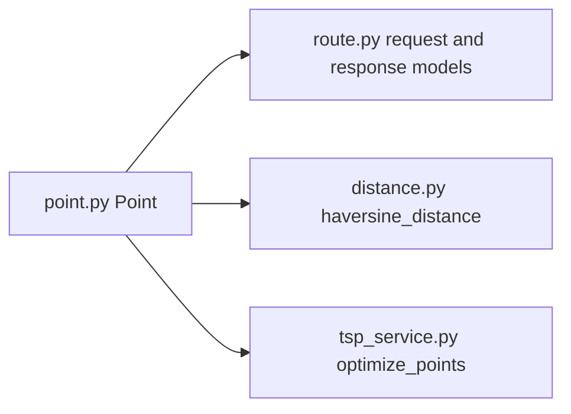
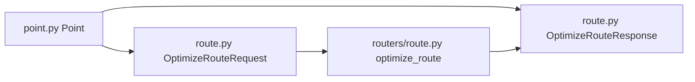
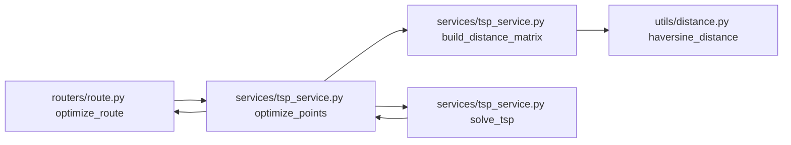
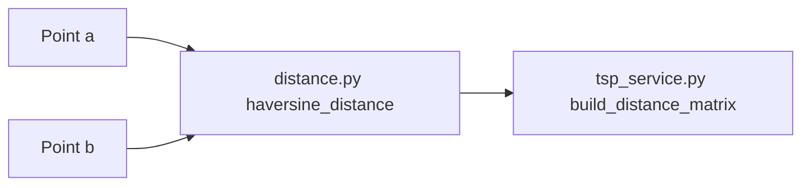
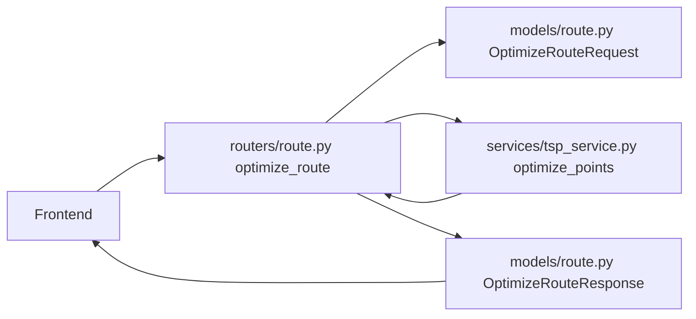
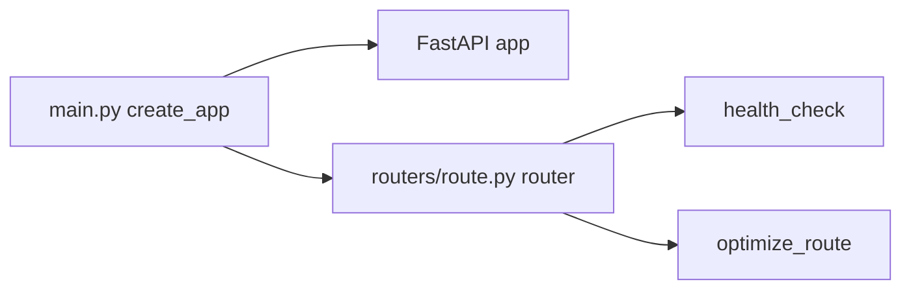
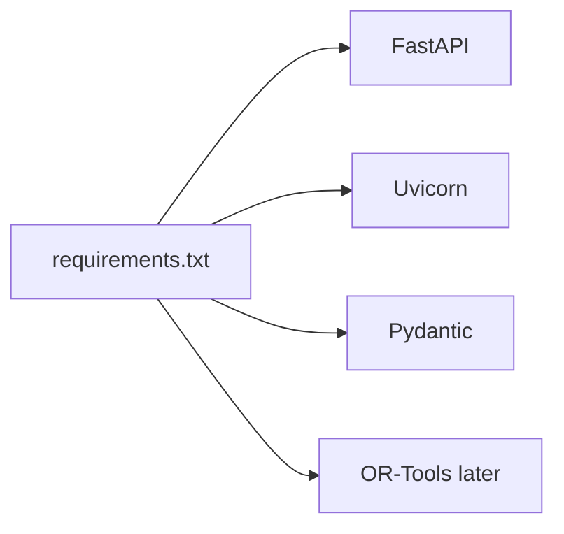
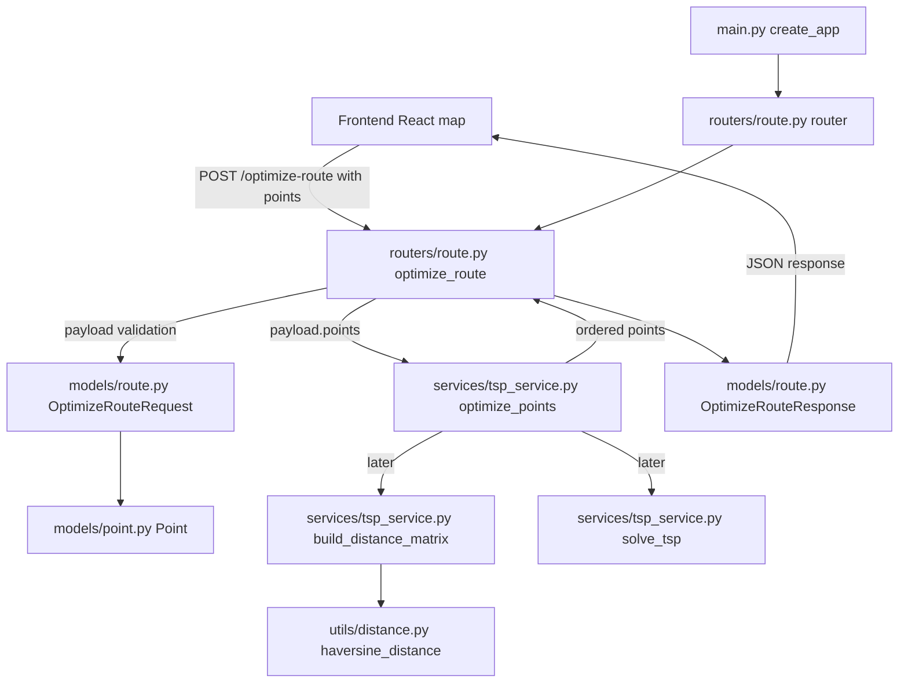
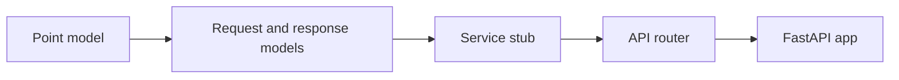

# Backend Structure Guide

This file is the implementation guide for the backend of the Road Finder app.

The backend will receive points from the frontend, optimize their visiting order, and return the ordered route.

## 1. Backend goal

The backend should do three main jobs:

1. Receive selected map points from the frontend.
2. Optimize the route order using a service function.
3. Return the optimized ordered points to the frontend.

At the beginning, the route optimization can be a stub. Later, the service function will use OR-Tools.

## 2. Recommended backend folder structure

```text
backend/
├── app/
│   ├── __init__.py
│   ├── main.py
│   ├── core/
│   │   ├── __init__.py
│   │   └── config.py
│   ├── models/
│   │   ├── __init__.py
│   │   ├── point.py
│   │   └── route.py
│   ├── routers/
│   │   ├── __init__.py
│   │   └── route.py
│   ├── services/
│   │   ├── __init__.py
│   │   └── tsp_service.py
│   └── utils/
│       ├── __init__.py
│       └── distance.py
├── requirements.txt
└── README.md
```

## 3. Files to write, in the correct order

### Step 1: [`backend/app/models/point.py`](../backend/app/models/point.py)

Write this file first because other files need the `Point` model.

Functions/classes to write:

1. `Point`
   - Type: Pydantic model.
   - Purpose: represents one location on the map.
   - Fields:
     - `lat: float`
     - `lng: float`

Interaction:



### Step 2: [`backend/app/models/route.py`](../backend/app/models/route.py)

Write this file second because the API endpoint needs request and response schemas.

Functions/classes to write:

1. `OptimizeRouteRequest`
   - Type: Pydantic model.
   - Purpose: represents the JSON body sent by the frontend.
   - Fields:
     - `points: list[Point]`

2. `OptimizeRouteResponse`
   - Type: Pydantic model.
   - Purpose: represents the JSON response returned to the frontend.
   - Fields:
     - `ordered_points: list[Point]`

Interaction:



### Step 3: [`backend/app/services/tsp_service.py`](../backend/app/services/tsp_service.py)

Write this file third because the API endpoint should delegate route logic to a service.

Functions to write:

1. `optimize_points(points)`
   - Purpose: receives a list of `Point` objects and returns them in optimized order.
   - First version: return the same points unchanged.
   - Later version: call `build_distance_matrix()` and `solve_tsp()`.

2. `build_distance_matrix(points)`
   - Purpose: builds a matrix of distances between all points.
   - Uses: `haversine_distance()` from [`backend/app/utils/distance.py`](../backend/app/utils/distance.py).
   - Needed later for OR-Tools.

3. `solve_tsp(distance_matrix)`
   - Purpose: receives a distance matrix and returns the best visiting order.
   - First version: can be skipped or return a simple order.
   - Later version: uses OR-Tools.

Interaction:



### Step 4: [`backend/app/utils/distance.py`](../backend/app/utils/distance.py)

Write this file when you start real route optimization.

Functions to write:

1. `haversine_distance(a, b)`
   - Purpose: calculates distance between two map points using latitude and longitude.
   - Input:
     - `a: Point`
     - `b: Point`
   - Output:
     - distance in meters or kilometers.

Interaction:



### Step 5: [`backend/app/routers/route.py`](../backend/app/routers/route.py)

Write this file after the models and service stub exist.

Functions/objects to write:

1. `router = APIRouter()`
   - Purpose: creates a route group for backend endpoints.

2. `health_check()`
   - Endpoint: `GET /health`
   - Purpose: checks if the backend is running.
   - Return example:
     - `{ "status": "ok" }`

3. `optimize_route(payload)`
   - Endpoint: `POST /optimize-route`
   - Input: `OptimizeRouteRequest`
   - Calls: `optimize_points(payload.points)`
   - Output: `OptimizeRouteResponse`

Interaction:



### Step 6: [`backend/app/core/config.py`](../backend/app/core/config.py)

Write this file when the app needs configuration.

Functions/classes to write:

1. `Settings`
   - Type: configuration class.
   - Purpose: stores app-level settings.
   - Fields:
     - `app_name`
     - `debug`
     - `cors_origins`

Interaction:


### Step 7: [`backend/app/main.py`](../backend/app/main.py)

Write this file after the router exists because it wires everything together.

Functions/objects to write:

1. `create_app()`
   - Purpose: creates the FastAPI application.
   - Calls/includes:
     - `FastAPI()`
     - `app.include_router(route.router)`
   - Later can add:
     - CORS middleware
     - app settings

2. `app = create_app()`
   - Purpose: exposes the ASGI application for Uvicorn.

Interaction:



### Step 8: [`backend/requirements.txt`](../backend/requirements.txt)

Write this file to list backend dependencies.

Packages to include first:

```text
fastapi
uvicorn[standard]
pydantic
```

Add later:

```text
ortools
```

Interaction:



## 4. Full function interaction flow



## 5. First version to implement

For the first backend version, write only the minimum needed to make the API work.

Write these files first:

1. [`backend/app/models/point.py`](../backend/app/models/point.py)
2. [`backend/app/models/route.py`](../backend/app/models/route.py)
3. [`backend/app/services/tsp_service.py`](../backend/app/services/tsp_service.py)
4. [`backend/app/routers/route.py`](../backend/app/routers/route.py)
5. [`backend/app/main.py`](../backend/app/main.py)
6. [`backend/requirements.txt`](../backend/requirements.txt)

Minimum functions/classes for first version:

1. `Point`
2. `OptimizeRouteRequest`
3. `OptimizeRouteResponse`
4. `optimize_points(points)`
5. `health_check()`
6. `optimize_route(payload)`
7. `create_app()`
8. `app = create_app()`

## 6. First version request and response

Frontend sends this:

```json
{
  "points": [
    { "lat": 10.762622, "lng": 106.660172 },
    { "lat": 10.776889, "lng": 106.700806 }
  ]
}
```

Backend returns this in the stub version:

```json
{
  "ordered_points": [
    { "lat": 10.762622, "lng": 106.660172 },
    { "lat": 10.776889, "lng": 106.700806 }
  ]
}
```

In the OR-Tools version, `ordered_points` will return the optimized visiting order.

## 7. Summary: what to write first

Start with [`backend/app/models/point.py`](../backend/app/models/point.py), then build outward:


