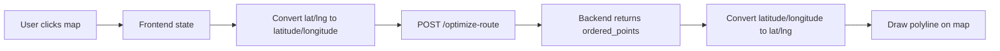

# Frontend Web App Specification

This document describes how the Road Finder web app should look and behave from the user's perspective, and how map clicks become data for processing.

## 1. Is this a web app?

Yes. This project is a web application.

The frontend runs in the browser and shows an interactive map. The user does not install a mobile app or desktop app. They open the website, click on the map, and the app processes those points in the browser plus backend API.

## 2. Product vision

The app should feel similar to Google Maps in the sense that it:

- shows a real map
- lets the user click locations
- displays pins/markers
- draws a route line

However, it is not a full Google Maps clone. The app only focuses on:

- selecting route points
- sending those points to the backend
- getting the route order back
- drawing the resulting route on the map

## 3. Main user flow

1. User opens the web page.
2. A map is shown.
3. User clicks on the map to add points.
4. Each click creates one marker.
5. The selected points are shown in a list.
6. User clicks **Optimize Route**.
7. Frontend sends the points to the backend.
8. Backend returns the ordered points.
9. Frontend draws the route line on the map.
10. User can clear points and start again.

## 4. What the app should display

### 4.1 Map area

The main screen should have a map as the primary visual element.

The map should:

- use OpenStreetMap tiles
- support clicking anywhere on the map
- show selected points as markers
- show a route polyline after optimization

### 4.2 Control panel

The app should also show a small panel with controls:

- **Optimize Route** button
- **Clear** button
- optional loading state while calling the backend
- optional error message if the request fails

### 4.3 Point list

The app should show a list of selected points so the user can:

- see how many points were chosen
- inspect coordinates
- remove a single point
- clear everything

## 5. How map clicks become data

The app converts user clicks into structured data.

### 5.1 Leaflet click format

When the user clicks the map, Leaflet gives coordinates in this shape:

```js
{
  lat: 10.762622,
  lng: 106.660172
}
```

### 5.2 Backend request format

Before sending to the backend, the frontend converts that point into:

```json
{
  "latitude": 10.762622,
  "longitude": 106.660172
}
```

This matches the backend model in [`backend/app/models/point.py`](../backend/app/models/point.py).

### 5.3 Backend response format

The backend returns ordered points in this shape:

```json
{
  "ordered_points": [
    {
      "latitude": 10.762622,
      "longitude": 106.660172
    },
    {
      "latitude": 10.776889,
      "longitude": 106.700806
    }
  ]
}
```

This matches the response model in [`backend/app/models/route_models.py`](../backend/app/models/route_models.py).

### 5.4 Map drawing format

After receiving the response, the frontend converts the points back into Leaflet format for drawing:

```js
[
  { lat: 10.762622, lng: 106.660172 },
  { lat: 10.776889, lng: 106.700806 }
]
```

## 6. Data flow inside the web app



## 7. UI behavior rules

### 7.1 Adding points

- Every map click adds one point.
- The point appears immediately as a marker.
- The point is added to the selected points list.

### 7.2 Optimizing route

- The Optimize button should be enabled only when there are at least 2 points.
- If the backend is processing, the button should show a loading state.
- When the response arrives, the map line should be updated.

### 7.3 Clearing points

- Clear should remove all selected points.
- Clear should also remove the route polyline.

### 7.4 Removing a single point

- The user should be able to remove one point from the list.
- The map markers and route line should update immediately.

## 8. Visual layout suggestion

A practical layout for the web page is:

- top bar with title
- main content split into two areas
  - left: interactive map
  - right: control panel and point list

This makes the app easy to use on desktop and still workable on smaller screens.

## 9. Current backend limitation

The current backend is a stub.

The route service in [`backend/app/services/tsp_service.py`](../backend/app/services/tsp_service.py) currently returns the points unchanged. That means the first version of the web app will show the same point order, but the full UI flow will already be ready for future optimization.

## 10. What this web app is not

This app is not intended to be:

- a full turn-by-turn navigation app
- a complete Google Maps replacement
- a street-level routing engine

It is a route-point selection and optimization web app.

## 11. Summary

The frontend is a browser-based map application where the user clicks on a map to create points, sends those points to the backend for ordering, and sees the resulting route drawn back on the map.

The key idea is:

- UI clicks become coordinate data
- coordinate data becomes API payload
- API response becomes a visual route
