# Frontend Structure Guide

This file is the implementation guide for the frontend of the Road Finder app.

The frontend will let a user select points on a map, send those points to the backend, receive the route order, and draw the route on the map.

## 1. Frontend goal

The frontend should do four main jobs:

1. Show an interactive map to the user.
2. Let the user select route points on the map.
3. Send selected points to the backend route API.
4. Draw the returned ordered route on the map.

At the beginning, the backend returns the same points unchanged. Later, when the backend uses OR-Tools, the frontend should not need major changes because it will already read `ordered_points` from the API response.

## 2. Recommended frontend folder structure

```text
frontend/
├── index.html
├── package.json
├── vite.config.js
├── src/
│   ├── main.jsx
│   ├── App.jsx
│   ├── App.css
│   ├── api/
│   │   └── routeApi.js
│   ├── components/
│   │   ├── MapView.jsx
│   │   ├── RouteControls.jsx
│   │   └── PointList.jsx
│   ├── hooks/
│   │   └── useRoutePoints.js
│   └── types/
│       └── point.js
├── Frontend_Structure.md
└── Walkthrough.md
```

## 3. Backend API contract used by the frontend

The backend currently exposes two endpoints.

### Health endpoint

Endpoint:

```text
GET /health
```

Expected response:

```json
{
  "status": "ok"
}
```

Frontend use:

- Optional first check to make sure the backend server is running.
- Not required for the first map UI version.

### Optimize route endpoint

Endpoint:

```text
POST /optimize-route
```

Request body sent by the frontend:

```json
{
  "points": [
    {
      "latitude": 10.762622,
      "longitude": 106.660172
    },
    {
      "latitude": 10.776889,
      "longitude": 106.700806
    }
  ]
}
```

Response body returned by the backend:

```json
{
  "ordered_points": [
    {
      "latitude": 10.762622,
      "longitude": 106.660172
    },
    {
      "latitude": 10.776889,
      "longitude": 106.700806
    }
  ]
}
```

Important frontend rule:

- Use `latitude` and `longitude` field names when sending data to the backend.
- Leaflet often uses `lat` and `lng`, so convert between Leaflet data and backend data.

## 4. Files to write, in the correct order

### Step 1: `frontend/package.json`

Create the React + Vite project dependencies.

Packages to include first:

```text
@vitejs/plugin-react
vite
react
react-dom
leaflet
react-leaflet
@tanstack/react-query
```

Scripts to include:

```json
{
  "dev": "vite",
  "build": "vite build",
  "preview": "vite preview"
}
```

Interaction:

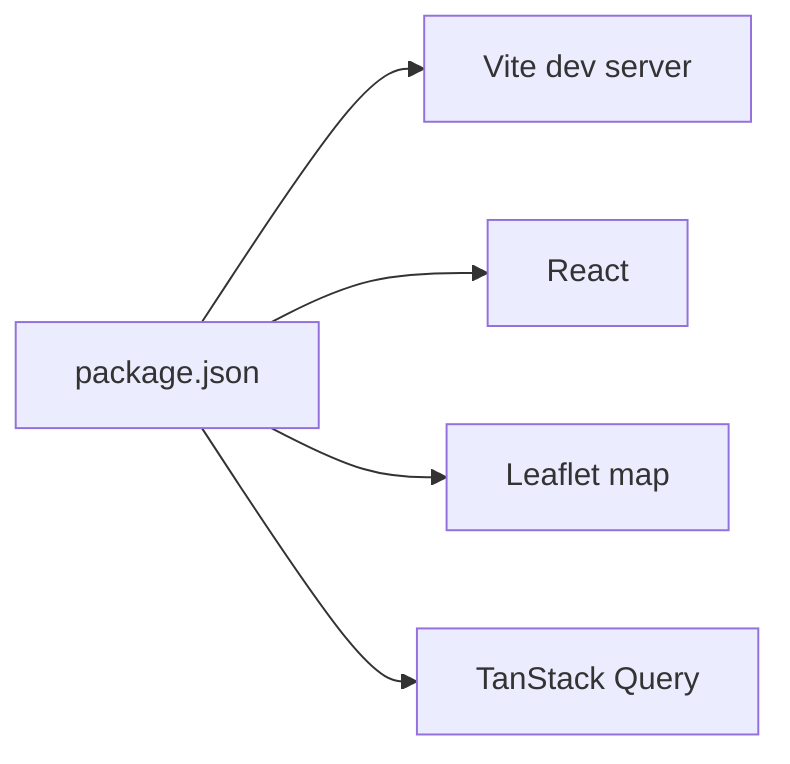

### Step 2: `frontend/index.html`

Create the HTML entry file used by Vite.

Main responsibility:

- Provide the `root` element where React renders the app.

Expected root element:

```html
<div id="root"></div>
```

Interaction:

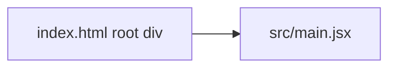

### Step 3: `frontend/src/main.jsx`

Create the React entry point.

Functions/objects to write:

1. `QueryClient`
   - Purpose: creates the TanStack Query client.

2. `createRoot()`
   - Purpose: mounts React into `index.html`.

3. `QueryClientProvider`
   - Purpose: allows components to use TanStack Query hooks.

Interaction:

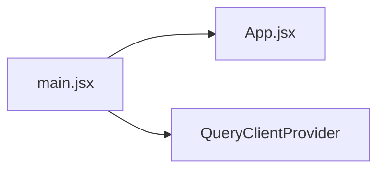

### Step 4: `frontend/src/types/point.js`

Create simple point-shape helpers or comments for the data model.

Point shape used by the backend:

```js
{
  latitude: number,
  longitude: number
}
```

Leaflet point shape commonly used in UI code:

```js
{
  lat: number,
  lng: number
}
```

Functions to write:

1. `toBackendPoint(leafletPoint)`
   - Input: `{ lat, lng }`
   - Output: `{ latitude, longitude }`

2. `toLeafletPoint(apiPoint)`
   - Input: `{ latitude, longitude }`
   - Output: `{ lat, lng }`

Interaction:

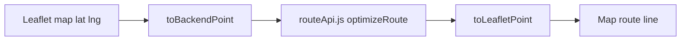

### Step 5: `frontend/src/api/routeApi.js`

Create API functions for backend calls.

Constants/functions to write:

1. `API_BASE_URL`
   - First version can be `http://localhost:8000`.
   - Later version can read from an environment variable like `VITE_API_BASE_URL`.

2. `checkHealth()`
   - Calls `GET /health`.
   - Returns parsed JSON.

3. `optimizeRoute(points)`
   - Input: backend point objects with `latitude` and `longitude`.
   - Calls `POST /optimize-route`.
   - Sends `{ points }`.
   - Returns parsed JSON with `ordered_points`.

Interaction:

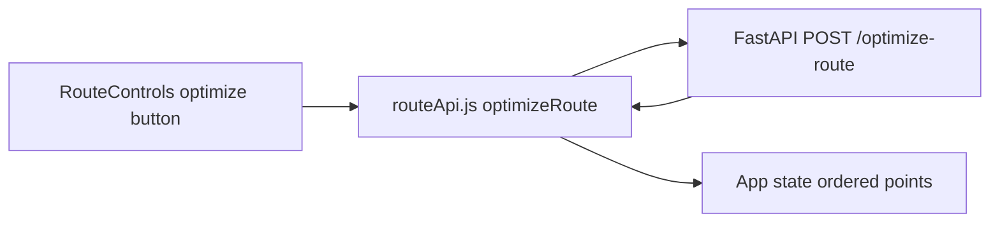

### Step 6: `frontend/src/hooks/useRoutePoints.js`

Create a custom hook to manage selected points and ordered route points.

State/functions to write:

1. `selectedPoints`
   - Stores points selected by the user on the map.

2. `orderedPoints`
   - Stores points returned by the backend.

3. `addPoint(point)`
   - Adds one clicked map point.

4. `removePoint(index)`
   - Removes one selected point.

5. `clearPoints()`
   - Clears selected points and route result.

6. `setRouteResult(points)`
   - Stores ordered points from backend response.

Interaction:

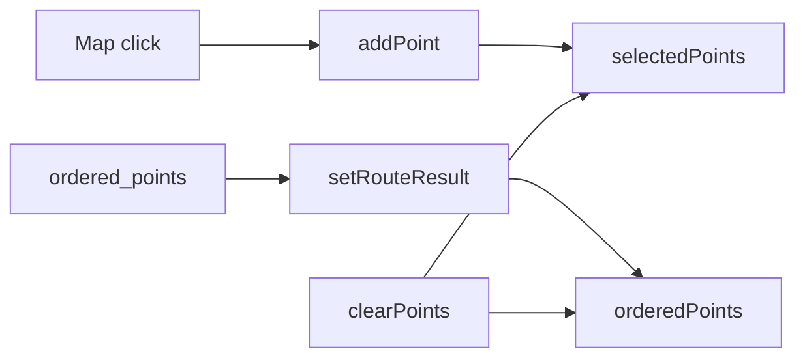

### Step 7: `frontend/src/components/MapView.jsx`

Create the map UI.

Functions/components to write:

1. `MapView`
   - Props:
     - `selectedPoints`
     - `orderedPoints`
     - `onAddPoint`
   - Shows the Leaflet map.
   - Adds a marker for each selected point.
   - Draws a route line using `orderedPoints` when available.

2. `MapClickHandler`
   - Uses Leaflet map click events.
   - Calls `onAddPoint({ lat, lng })`.

Important UI rule:

- Markers and route lines should use Leaflet `{ lat, lng }` or `[lat, lng]` format.
- API calls should use backend `{ latitude, longitude }` format.

Interaction:

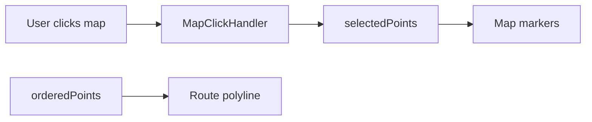

### Step 8: `frontend/src/components/RouteControls.jsx`

Create buttons for route actions.

Functions/components to write:

1. `RouteControls`
   - Props:
     - `selectedPoints`
     - `onOptimize`
     - `onClear`
     - `isOptimizing`
   - Shows an Optimize Route button.
   - Shows a Clear button.
   - Disables optimize when fewer than two points exist.

Interaction:

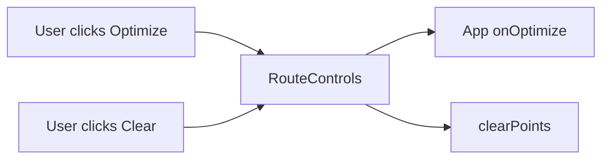

### Step 9: `frontend/src/components/PointList.jsx`

Create a simple list of selected points.

Functions/components to write:

1. `PointList`
   - Props:
     - `selectedPoints`
     - `onRemovePoint`
   - Shows each selected point.
   - Lets the user remove a selected point.

Interaction:

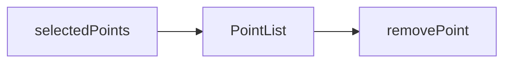

### Step 10: `frontend/src/App.jsx`

Create the main app shell.

Responsibilities:

1. Render the title and layout.
2. Use `useRoutePoints()` for point state.
3. Use TanStack Query mutation for route optimization.
4. Convert selected Leaflet points to backend points before API call.
5. Convert returned backend points to Leaflet points before drawing.
6. Render `MapView`, `RouteControls`, and `PointList`.

Interaction:

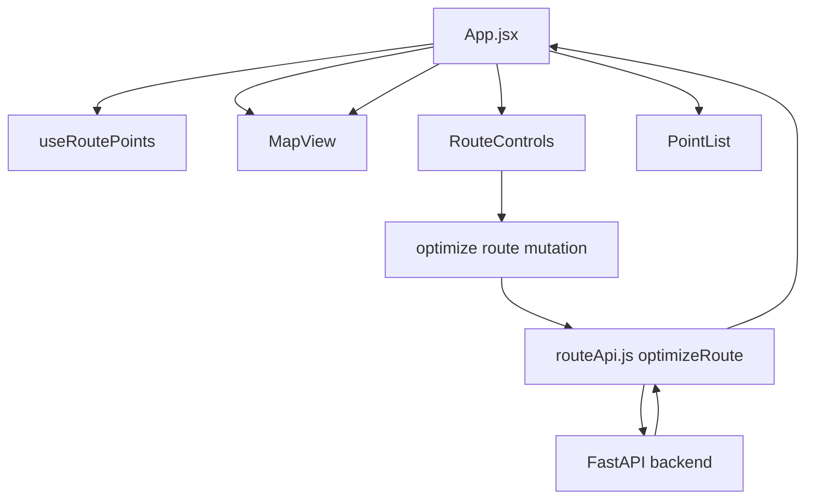

### Step 11: `frontend/src/App.css`

Create basic styles.

Styles to include:

1. Full-page layout.
2. Map container height.
3. Sidebar or control panel.
4. Buttons.
5. Point list rows.

Important Leaflet rule:

- Import Leaflet CSS in `main.jsx` or `App.jsx`:

```js
import "leaflet/dist/leaflet.css";
```

- Make sure the map container has a real height, otherwise the map will not appear.

## 5. Full frontend interaction flow

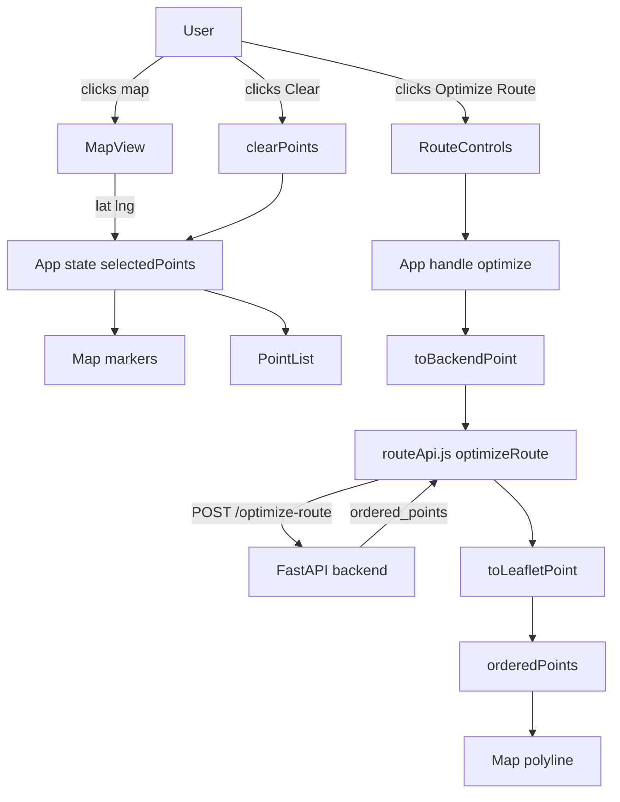

## 6. First frontend version to implement

For the first frontend version, write only the minimum needed to make the map flow work.

Write these files first:

1. `frontend/package.json`
2. `frontend/index.html`
3. `frontend/src/main.jsx`
4. `frontend/src/App.jsx`
5. `frontend/src/App.css`
6. `frontend/src/api/routeApi.js`
7. `frontend/src/types/point.js`
8. `frontend/src/hooks/useRoutePoints.js`
9. `frontend/src/components/MapView.jsx`
10. `frontend/src/components/RouteControls.jsx`
11. `frontend/src/components/PointList.jsx`

Minimum functions/components for first version:

1. `toBackendPoint(leafletPoint)`
2. `toLeafletPoint(apiPoint)`
3. `optimizeRoute(points)`
4. `useRoutePoints()`
5. `MapView`
6. `MapClickHandler`
7. `RouteControls`
8. `PointList`
9. `App`

## 7. First version request and response

Frontend selected points in map state:

```js
[
  { lat: 10.762622, lng: 106.660172 },
  { lat: 10.776889, lng: 106.700806 }
]
```

Frontend sends this to backend:

```json
{
  "points": [
    { "latitude": 10.762622, "longitude": 106.660172 },
    { "latitude": 10.776889, "longitude": 106.700806 }
  ]
}
```

Backend returns this in the stub version:

```json
{
  "ordered_points": [
    { "latitude": 10.762622, "longitude": 106.660172 },
    { "latitude": 10.776889, "longitude": 106.700806 }
  ]
}
```

Frontend draws this route:

```js
[
  { lat: 10.762622, lng: 106.660172 },
  { lat: 10.776889, lng: 106.700806 }
]
```

## 8. Summary: what to write first

Start with the Vite app shell, then build outward:

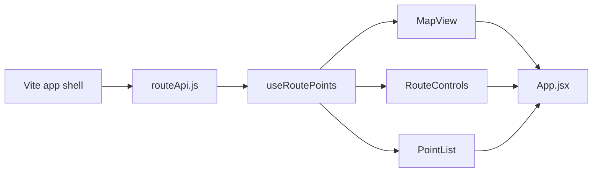
