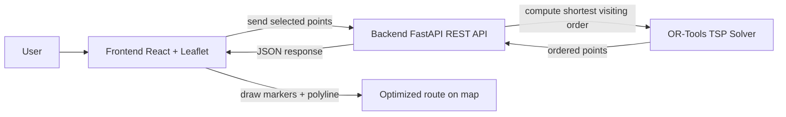

# Road Finder Architecture Overview

This note explains how the app pieces interact before implementation starts.

## System flow

## How the files should interact

### Frontend
- [`frontend/`](frontend) will hold the React app.
- The map screen will:
  - display the map
  - let the user place points
  - send the points to the backend
  - render the returned ordered route

### Backend
- [`backend/`](backend) will hold the FastAPI service.
- It will expose:
  - `GET /health` for service checks
  - `POST /optimize-route` to receive points and return an optimized order
- The backend will later call OR-Tools to solve the TSP.

### Solver
- OR-Tools will be used only inside the backend.
- It should not be called directly from the frontend.
- The backend acts as the orchestration layer between the UI and the solver.

## Recommended next step

Build the backend first, but only as a thin API shell:
1. create the FastAPI project structure
2. define request/response models
3. add a stub `/optimize-route` endpoint
4. verify the frontend can later call it

This gives a stable contract before the map UI is built.