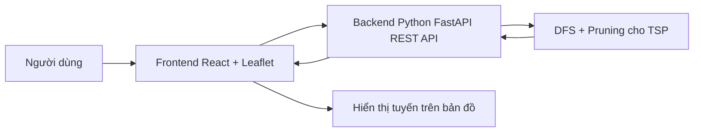

# Kế hoạch làm web tối ưu lộ trình cho shipper

## 1. Mục tiêu
Xây dựng một web đơn giản theo đúng yêu cầu trong slide:
- Người dùng mở web và nhìn thấy bản đồ
- Người dùng click để chọn các điểm trên bản đồ
- Người dùng bấm nút để gửi các điểm đã chọn lên backend
- Backend chạy thuật toán giải bài toán TSP
- Frontend hiển thị lại lộ trình tối ưu trên bản đồ

Mục tiêu ưu tiên là **dễ làm, dễ hiểu, phù hợp cho sinh viên mới bắt đầu**.

## 2. Phạm vi tối thiểu cần làm
### Những phần cần làm trước
- Hiển thị bản đồ OpenStreetMap
- Cho phép click để chọn nhiều điểm
- Hiển thị marker cho các điểm đã chọn
- Có nút để gửi dữ liệu lên backend
- Backend nhận danh sách điểm và trả về lộ trình tối ưu
- Vẽ lộ trình tối ưu lên bản đồ

### Chưa làm ở giai đoạn đầu
- Đăng nhập, đăng ký
- Lưu lịch sử người dùng
- Phân quyền
- Giao diện quá phức tạp
- Tính năng nâng cao như thời gian giao hàng, nhiều ràng buộc phức tạp

## 3. Tech stack đề xuất
Mình chọn stack đơn giản, gần với thói quen code Python của bạn:

### Frontend
- **ReactJS**: dễ tách phần giao diện thành các component nhỏ
- **Vite**: tạo project nhanh và nhẹ
- **Leaflet**: thư viện bản đồ dễ dùng với OpenStreetMap
- **OpenStreetMap**: nền bản đồ miễn phí
- **Axios**: gọi API từ frontend sang backend

### Backend
- **Python**: ngôn ngữ chính bạn đã quen
- **FastAPI**: làm REST API rất thuận tiện, dễ đọc, dễ test
- **Uvicorn**: chạy server cho FastAPI
- **Pydantic**: kiểm tra dữ liệu đầu vào và đầu ra của API

### Thuật toán
- **TSP**: bài toán tối ưu lộ trình
- **DFS**: dùng để duyệt mọi khả năng đi qua các điểm
- **Pruning**: cắt nhánh sớm để giảm số trường hợp phải thử

Lưu ý đơn giản:
- DFS là cách dễ hiểu để bắt đầu
- Nếu số điểm quá nhiều thì DFS sẽ chạy rất lâu
- Vì vậy nên giới hạn số điểm trong bản đầu tiên, ví dụ 5 đến 10 điểm

### Công cụ hỗ trợ
- **VS Code**: viết code
- **Git**: lưu phiên bản code
- **Postman**: test API backend trước khi nối frontend

## 4. Kiến trúc hệ thống


## 5. Luồng hoạt động của web
1. Người dùng mở trang web
2. Bản đồ hiện ra
3. Người dùng click để chọn các điểm cần đi qua
4. Frontend lưu danh sách tọa độ các điểm
5. Người dùng bấm nút **Tối ưu lộ trình**
6. Frontend gửi danh sách điểm lên backend qua API
7. Backend dùng DFS để thử các thứ tự đi qua các điểm
8. Backend chọn ra lộ trình có tổng quãng đường nhỏ nhất
9. Backend trả về thứ tự các điểm và đường đi tối ưu
10. Frontend vẽ lại đường đi trên bản đồ

## 6. Danh sách API dự kiến
### API chính
- `POST /api/route/optimize`

### Dữ liệu gửi lên
- Danh sách các điểm đã chọn
- Mỗi điểm gồm latitude và longitude

### Dữ liệu trả về
- Thứ tự các điểm cần đi qua
- Tổng quãng đường
- Dữ liệu để vẽ đường polyline

## 7. Các bước triển khai
### Bước 1: Tạo giao diện bản đồ
- Tạo trang web cơ bản
- Hiển thị bản đồ OpenStreetMap bằng Leaflet
- Cho click để thêm marker

### Bước 2: Tạo backend Python API mẫu
- Tạo project FastAPI
- Viết API `POST /api/route/optimize`
- Ban đầu trả dữ liệu mẫu để kiểm tra frontend

### Bước 3: Làm thuật toán TSP bằng DFS
- Nhận danh sách điểm
- Duyệt các thứ tự có thể đi qua
- Tính tổng quãng đường từng phương án
- Chọn phương án tốt nhất
- Thêm pruning để giảm số nhánh phải thử

### Bước 4: Nối frontend với backend
- Frontend gửi điểm đã chọn lên backend
- Backend trả kết quả thật
- Frontend vẽ đường tối ưu lên bản đồ

### Bước 5: Hoàn thiện giao diện
- Thêm nút xóa điểm
- Thêm nút làm lại
- Hiển thị tổng quãng đường
- Kiểm tra lại trải nghiệm người dùng

## 8. Cấu trúc thư mục gợi ý
```text
project/
├── frontend/
│   ├── src/
│   └── package.json
├── backend/
│   ├── app/
│   ├── main.py
│   └── requirements.txt
└── plans/
    └── Plan.md
```

## 9. Nguyên tắc làm cho người mới bắt đầu
- Làm từng phần nhỏ, không làm tất cả cùng lúc
- Ưu tiên chạy được trước, đẹp sau
- Mỗi bước xong mới sang bước tiếp theo
- Giữ code đơn giản, dễ đọc, dễ sửa
- Với TSP, bắt đầu bằng DFS cho ít điểm trước rồi mới tối ưu thêm

## 10. Nên làm gì trước
Nếu làm như một senior, thứ tự tốt nhất là:
1. **Init folder và chốt cấu trúc project**
   - Tạo rõ `frontend/`, `backend/`, `plans/`
   - Việc này giúp sau này không bị rối
2. **Viết backend trước ở mức tối thiểu**
   - Tạo FastAPI project
   - Tạo sẵn API `POST /api/route/optimize`
   - Trước tiên có thể trả dữ liệu mẫu
3. **Viết frontend sau**
   - Tạo giao diện bản đồ
   - Gửi thử dữ liệu lên backend
4. **Cuối cùng mới gắn thuật toán DFS cho TSP**
   - Khi frontend và backend đã nói chuyện được với nhau, lúc đó mới thay dữ liệu mẫu bằng kết quả thật

### Vì sao nên làm theo thứ tự này
- **Init folder trước** để mọi thứ rõ ràng ngay từ đầu
- **Backend trước** vì API là phần lõi của bài toán
- **Frontend sau** để có chỗ hiển thị và test API
- **Thuật toán cuối cùng** vì đây là phần khó nhất, làm sau khi khung đã ổn

## 11. Kết quả mong đợi
Sau khi hoàn thành, web sẽ có thể:
- Cho người dùng chọn điểm trên bản đồ
- Gửi dữ liệu lên backend bằng REST API
- Tính tuyến đường tối ưu bằng DFS cho TSP
- Hiển thị kết quả trực quan trên bản đồ
