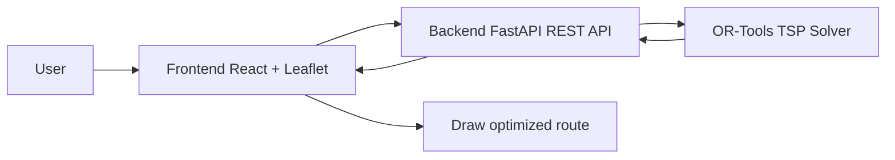

# Kế hoạch làm web tối ưu lộ trình cho shipper

## Goal
- Làm web chọn điểm trên bản đồ
- Gửi các điểm lên backend
- Backend giải TSP
- Frontend vẽ lộ trình tối ưu

## Tech stack
- Frontend: ReactJS, Vite, Leaflet, OpenStreetMap, Axios
- Backend: Python, FastAPI, Uvicorn, Pydantic
- Algorithm: OR-Tools for TSP
- API style: REST API

## Step
1. Init folder
2. Build backend API first
3. Build frontend map UI
4. Connect frontend and backend
5. Use OR-Tools to solve TSP
6. Show result on the map

## Mermaid

## Checklist
- [x] Read the slide and understand the problem
- [x] Define the minimum scope
- [x] Choose the simple architecture
- [x] Design the user flow
- [x] List the API needed
- [x] Break the work into steps
- [x] Create the root folders
- [ ] Create the backend FastAPI project
- [ ] Create the frontend React project
- [ ] Implement the optimize route API
- [ ] Implement the map UI
- [ ] Integrate OR-Tools TSP solver
- [ ] Draw the optimized route on the map
