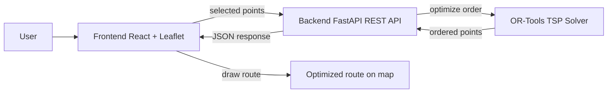

# Road Finder Plan

## Goal

Build a web app for shippers to choose points on a map, send those points to the backend, optimize the visiting order, and draw the optimized route on the map.

## Tech stack

- Frontend: React, Vite, Leaflet, OpenStreetMap, TanStack Query, Fetch API
- Backend: Python, FastAPI, Uvicorn, Pydantic
- Algorithm: OR-Tools for TSP
- API style: REST API

## System flow

## Build order

1. Build backend FastAPI API first.
2. Create frontend React + Vite map UI.
3. Connect frontend to backend.
4. Add OR-Tools TSP optimization.
5. Draw the optimized route on the map.

## API needed first

- `GET /health`: check backend is running.
- `POST /optimize-route`: receive points and return ordered points.

## Project checklist

- [x] Define minimum scope
- [x] Choose architecture
- [x] Create root folders
- [x] Create first backend model: `Point`
- [ ] Complete backend FastAPI shell
- [ ] Create frontend React + Vite app
- [ ] Implement map point selection
- [ ] Connect frontend and backend
- [ ] Integrate OR-Tools TSP solver
- [ ] Draw optimized route on map
